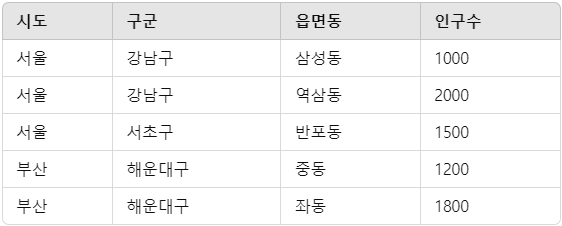

# 0226
### 집계함수(Aggregate Function)
* 집계 함수 : 여러 행의 데이터를 요약해서 하나의 값으로 추출하는 함수
* SUM(): 합계를 구하는 함수 - `SUM(sale_price)`
* AVG(): 평균값을 구하는 함수 - `AVG(sale_price)`
* COUNT(): 행의 개수를 세는 함수 - `COUNT(*)` 또는 `COUNT(column)`
* MAX(): 최대값을 구하는 함수 - `MAX(sale_price)`
* MIN(): 최소값을 구하는 함수 - `MIN(sale_price)`
```sql
select sum(saleprice) from orders;
select avg(saleprice) from orders;
select count(*) from orders;  -- 전체 row 수
select max(saleprice) from orders;
select min(saleprice) from orders;
```

`WHERE`로 조건을 만족하는 row만 지정할 수 있다.
```sql
select *  from orders where saleprice >= 10000;
select sum(saleprice)  from orders where saleprice >= 10000;
select * from orders where custid = 1;
select max(saleprice)  from orders where custid = 1;
select * from orders where saleprice = ( select max(saleprice)  from orders where custid = 1 );
```

집계함수를 한 꺼번에 컬럼으로 작성할 수도 있다.
```sql
select sum(saleprice),  avg(saleprice),  min(saleprice),  max(saleprice)  from orders;
select sum(saleprice),  avg(saleprice),  min(custid),  max(orderdate)  from orders;
select sum(saleprice) as sum_price,  avg(saleprice) as avg_price,  min(saleprice),  max(saleprice)  from orders; -- alias
```
> `COUNT(*)`는 전체 행 개수를 세지만, `COUNT(column)`은 NULL이 아닌 행만 계산한다.

> 나머지 집계함수들은 NULL 값들은 제외를 하고 요약값을 추출한다.

### GROUP BY - 그룹화
* 특정 컬럼 값이 같은 행들을 그룹화하여 집계하는 기능
* 그룹별로 집계함수 적용 가능
```sql
-- 고객별
select custid, count(*) as '도서수량', sum(saleprice) as '총액' from orders 
group by custid;
-- 도서별  
select bookid, count(*) as '도서수량', sum(saleprice) as '총액' from orders 
group by bookid;  
-- 일자별  
select orderdate, count(*) as '도서수량', sum(saleprice) as '총액' from orders 
group by orderdate; 
```

또한, `GROUP BY`에 다중 컬럼을 사용하여 여러 컬럼을 기준으로 그룹화가 가능하다.
```sql
 SELECT orderdate, custid, SUM(saleprice) AS '총액' FROM orders GROUP BY orderdate, custid;
```
> `GROUP BY`에서 여러 컬럼을 사용할 때, 더 큰 범위(상위 개념)부터 그룹핑 해야한다.<br>
```sql
SELECT 시도, 구군, 읍면동, SUM(인구수) AS 총인구
FROM 지역_인구
GROUP BY 시도, 구군, 읍면동;
```

> `GROUP BY`시 NULL 값이 있을때는 NULL 값을 가지는 튜플끼리 묶인다.

### HAVING 
* `GROUP BY`로 생성된 그룹에 대해 필터링 적용
* `HAVING`절에 명시된 조건을 만족하는 그룹만 결과에 포함된다.
```sql
select custid, count(*) as '도서수량'  from orders where saleprice >= 8000 group by custid having count(*) >= 2; -- 집계 결과
select custid, count(*) as '도서수량' from orders where saleprice >= 8000 group by custid having custid >= 2; -- group by  항목
select custid, count(*) as '도서수량' from orders where saleprice >= 8000 group by custid having '도서수량' >= 2; --  집계 결과 문자열 alias 오류 X, 결과 X
select custid, count(*) as book_count from orders where saleprice >= 8000 group by custid having book_count >= 2; --  집계 결과 문자열 아닌 alias 오류 X, 결과 O
-- group by select 컬럼 주의
select bookid, count(*) as '도서수량'  from orders where saleprice >= 8000 group by custid having count(*) >= 2; -- group by 항목이 아닌 항목을 select 에 사용 
```
> `alias`로 HAVING 조건을 설정 시 문자열인 alias를 사용하면 결과가 이상하다.

### GROUP BY 사용 시 주의사항
* `SELECT` 절에는 `GROUP BY` 에 명시된 컬럼과 집계함수만 사용 가능
* 집계함수를 사용하지 않은 컬럼은 반드시 `GROUP BY` 절에 포함되어야 함

### 카티션 프로덕트(Cartesian Product)
* 두 개 이상의 테이블을 FROM 절에 콤마(,)로 연결하면 카티션 프로덕트 연산 수행
* 결과 행 수 : 첫 번째 테이블 행 수 x 두 번째 테이블 행 수
* 카티션 프로덕트는 모든 경우의 수를 조합 (customer 5건, orders 10건 → 결과 50건)
* 대부분의 경우 의미 있는 데이터를 얻기 위해 JOIN 조건 필요
```sql
select * from customer; -- 5 건
select * from orders; -- 10 건
select * from customer, orders;  -- 5 x 10 건
select * from customer, orders where customer.custid = orders.custid;  -- 위 카디젼프로덕트로부터 10 건 추출

select customer.custid, customer.name, orders.saleprice, orders.orderdate -- 원하는 테이블의 컬럼을 선택
  from customer, orders where customer.custid = orders.custid;   
```
> * 두 테이블에 중복되는 컬럼은 table 명을 생략하면 안된다. (custid)
> * 한 테이블에만 있는 컬럼은 table 명을 생략 O (name, saleprice)
> * 테이블명을 모두 명시하는 것이 가독성이 좋다.

### 이너 조인(INNER JOIN)
* 두 테이블에서 **조인 조건을 만족하는 행들만** 결과에 포함
* 조인 조건은 `WHERE` 절에 지정
```sql
select c.custid, c.name, o.saleprice, o.orderdate
  from customer c, orders o where c.custid = o.custid;  
-- order by  추가  
select c.custid, c.name, o.saleprice, o.orderdate
  from customer c, orders o where c.custid = o.custid
 order by c.custid;
-- sum (고객이름 <= 사실상 고객별 ... 처리 )
select c.name, sum(o.saleprice)
  from customer c, orders o where c.custid = o.custid
  group by  c.name
 order by c.name; 
-- 고객별 sum 을 구하는 데 동명이인이 있으면?
-- 고객의 구분자(식별자)인 Primary Key 로 group by  필요. 
select c.name, sum(o.saleprice)
  from customer c, orders o where c.custid = o.custid
  group by  c.custid -- Key 는 group by  에 올 수 있다.
 order by c.name;  
 ```

 ### 표준 ANSI SQL JOIN 문법
 * 명시적으로 `JOIN` 키워드 사용
 * 조인조건을 `WHERE`절이 아닌 `ON` 절에 작성하여 가독성이 좋도 조인 종류를 명확히 표현 가능
 * 세 개 이상 테이블 조인시 `JOIN`을 계속 연결
 ```sql
 select c.custid, c.name, o.saleprice, o.orderdate
  from customer c inner join orders o on c.custid = o.custid;

  -- inner  를 생략하면 기본 join 이 inner join
select c.name, c.address,  b.bookname, o.orderdate
  from orders o join customer c on o.custid = c.custid
                    join book b on o.bookid = b.bookid
where c.name like '김%' -- 고객이름이 김 으로 시작 ( select 항목 포함 )
   and o.saleprice < 10000; -- select 항목 포함 X
```

### 아우터 조인(OUTER JOIN)
* 조인 조건을 만족하지 않는 행도 결과에 포함
* `LEFT OUTER JOIN` : 왼쪽 테이블의 모든 행 포함
* 일치하는 행이 없는 경우 NULL 값으로 채워짐
* 주로 "모든 ~에 대해" 형태의 요구사항에 사용
* 실무 활용 예: 휴가 사용 내역 조회 시 휴가를 사용하지 않은 직원도 포함

```sql
-- 모든 고객 대상으로 고객 이름, 구매금액을 구하라(단, 구매하지 않은 고객도 포함)
select c.custid, o.saleprice
 from customer c left outer join orders o on c.custid = o.custid;

-- 모든 도서 대상으로  도서 이름, 판매금액을 구하라 ( 단, 판매하지 않은 도서도 포함 )   
select b.bookid, b.bookname, o.saleprice
   from book b left join orders o on b.bookid = o.bookid;
```

### 셀프 조인(SELF JOIN)
* 같은 테이블을 두 번 사용하여 조인
* 테이블 내에서 자기 참조 관계가 있을 때 사용
* 예시 : 직원 테이블에서 직원과 관리자 관계 조회
```sql
  SELECT staff.first_name, manager.first_name AS manager_name
  FROM employees staff
  JOIN employees manager ON staff.manager_id = manager.employee_id;
```

## 실무 활용 팁
### 조인 사용시 주의사항
* 조인 테이블이 많아질수록 성능 이슈 발생
* 실무에서는 보통 5개 이상의 테이블을 조인하는 경우 많음
* 테이블당 데이터 건수가 많은 경우(수백만건 이상) 조인 성능 고려 필요
* 카티션 프로덕트를 이해하고 필요한 조인 조건 누락 없도록 주의사항
* 테이블 별칭 사용 시 일관성 유지 및 직관적인 별칭 사용 권장

### 테이블 별칭 사용시
* 테이블명이 길거나 여러 테이블 조인 시 별칭 사용 권장
* 중복 컬럼명이 있는 경우 테이블명 또는 별칭으로 구분 필수
* 한 테이블에만 있는 컬럼은 테이블명 생략 가능하나 가독성을 위해 지정 권장
* 별칭 사용 예: FROM Customer AS c 또는 FROM Customer c

### JOIN vs 서브쿼리
* 같은 결과를 얻을 수 있는 여러 방법 존재
* JOIN은 여러 테이블의 데이터를 한 번에 조회할 때 유용
* 서브쿼리는 복잡한 조건이나 집계 결과를 활용할 때 유용
* 성능과 가독성 고려하여 적절한 방법 선택